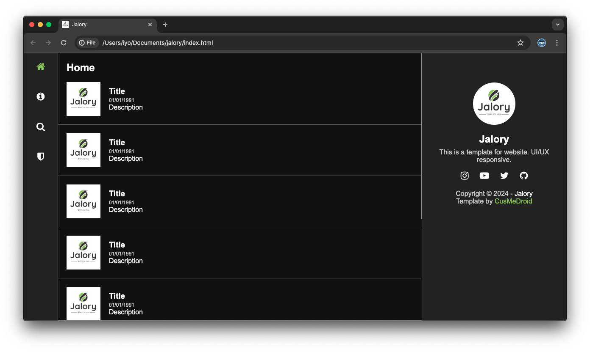
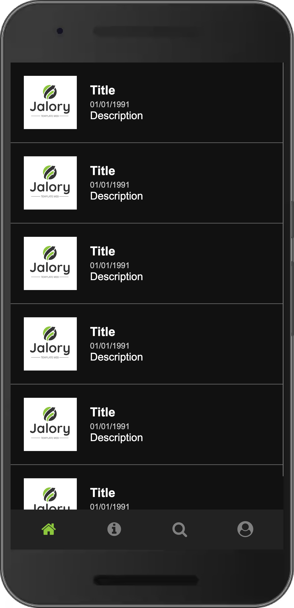
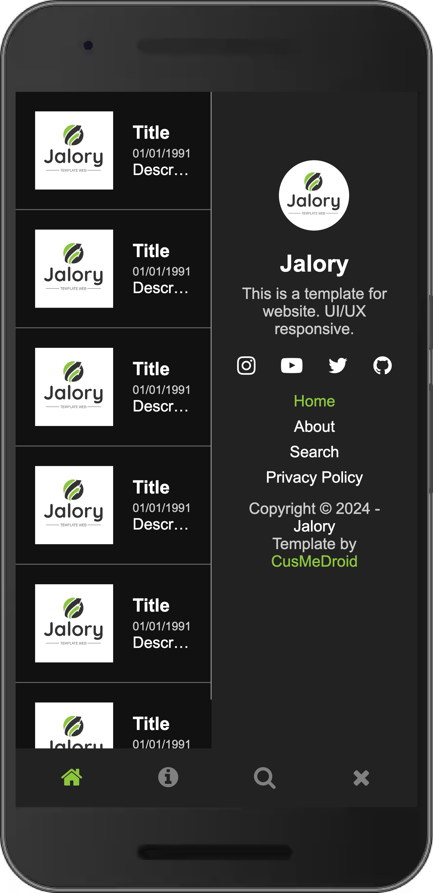

# Jalory
This is a template for website. UI/UX responsive.

# Guide CSS Edit
``` txt
------------------------
|      Theme Dark      |
------------------------
- Based color #222
- Hover link #8CC63E
- Background article #111
```

# Logo
[](assets/img/logo.png)

# Screenshot Tablet/PC
[](assets/screenshot/d001.png) 

# Screenshot Phone/Mobile
[](assets/screenshot/m001.png) [](assets/screenshot/m002.png)

# Clone
Select your directory location
```
cd '/c/Users/YOUR USERNAME HERE/ 'Name Project'
```

Download git
```
git clone https://github.com/CusMeDroid/jalory.git
```
# Donate
[](https://paypal.me/iyortml)
